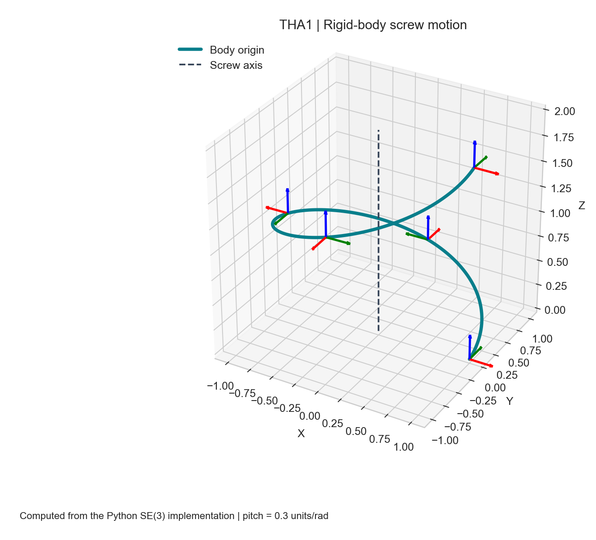

# Algorithms for Sensor-Based Robotics

**From rigid-body geometry to calibrated sensing and constrained robot motion.**

Course projects by **Daniel Agbara and Min-Geun Park**, developed for ME 384R, Algorithms for Sensor-Based Robotics, Spring 2026, taught by Prof. Farshid Alambeigi.



## Explore the projects

| Project | Engineering question | Implementation | Start here |
| --- | --- | --- | --- |
| **THA1 · Rotations and rigid motion** | How do rotation representations and screw axes describe a body's motion? | Python / NumPy | [Methods, demo and tests](THA1/README.md) |
| **THA2 · Manipulator kinematics** | How can a redundant seven-joint arm reach a pose and follow a path? | MATLAB | [KUKA kinematics and IK](THA2/README.md) |
| **THA3 · Sensor calibration** | How can measured points and camera poses be aligned with robot coordinates? | MATLAB | [Registration, pivot and hand–eye calibration](THA3/README.md) |
| **THA4 · Guided and constrained motion** | How can virtual fixtures and optimization guide motion around geometric constraints? | MATLAB | [Impedance and constrained IK](THA4/README.md) |

The project READMEs connect the implementations to the supplied course reports. Existing report results are distinguished from newly reproduced examples; these are simulations and numerical experiments.

## Run locally

Download the repository ZIP and extract it, or clone:

```sh
git clone https://github.com/DanielAgbara/ASBR.git
cd ASBR
```

### THA1: Python

Use Python 3.10 or later. From the repository root:

```sh
python -m venv .venv
```

Activate with `.venv\Scripts\Activate.ps1` in Windows PowerShell, or `source .venv/bin/activate` on macOS/Linux. If PowerShell activation is disabled, use `.venv\Scripts\python.exe` instead of `python` below.

```sh
python -m pip install -r requirements.txt
python -m pytest
python -m THA1.demo
```

The demo saves `outputs/tha1/screw-motion.png` without requiring a display. For the original interactive exercise, run `python -m THA1.pa3`.

### THA2–THA4: MATLAB

Open the repository root as MATLAB's current folder, then run:

```matlab
run_asbr                       % List available demos
run_asbr('tha3-hand-eye')       % A first calibration example
run_asbr('tha2-ik')             % KUKA inverse kinematics
run_asbr('tha4-tubular')        % Impedance-based path guidance
```

| Component | Requirements |
| --- | --- |
| THA2 robot demos | MATLAB and Robotics System Toolbox |
| THA3 calibration | MATLAB |
| THA4 tubular/conical demos | MATLAB |
| THA4 constrained IK | MATLAB, Robotics System Toolbox and Optimization Toolbox (`lsqlin`) |

MATLAB R2025b is the local validation environment; older releases and GNU Octave have not been verified. Some demos export videos, which take longer than the numerical solve and depend on the platform's video support.

The launcher adds only the selected project's code directory and restores the previous path and current folder afterward. Generated files go to `outputs/<demo>/`. Avoid adding the entire repository recursively to the MATLAB path: projects contain same-named helpers with potentially different conventions.

## Read and modify the code

- **Python:** `THA1/rotation.py` holds the rotation conversions; `THA1/pa3.py` contains screw-motion functions and the original interactive exercise; `THA1/demo.py` is the reproducible visual entry point.
- **MATLAB:** use the descriptive names in `run_asbr.m` to find each original experiment. The project READMEs map those names to source files and reusable solver functions.
- **Inputs:** change the initial state, target and solver settings in the selected experiment script. Library functions accept the mathematical inputs directly.
- **Conventions:** use radians unless explicitly converted with `deg2rad`; Python quaternions are scalar-first `[w,x,y,z]`; robot twists put angular components before linear components. THA3's raw quaternion tables are reordered by its demo.

The cleanup preserves the course algorithms and adds portable entry points. Earlier THA2 Python experiments, THA1's `temp.py`, THA4's `PART 1`, caches and bulk generated galleries are excluded from the proposed upload. They remain in the author's local workspace. See [maintenance notes](docs/MAINTENANCE.md) for the remaining refactoring work and validation boundaries.

## Results and provenance

THA2 includes original [path-following videos](THA2/results/videos). THA3 has selected original calibration figures. THA1's opening figure is newly generated from this repository. THA4's README explains the report's key limitation: a linearized wall constraint can permit temporary penetration when steps are large.

Original PDF submissions are kept local because some include student identifiers, email addresses and signatures. They are excluded by `.gitignore`; public summaries are in the project READMEs.

## Credits and reuse

Project authors: Daniel Agbara and Min-Geun Park. Original project code and documentation are released under the [MIT license](LICENSE), allowing use, modification and redistribution with the license notice retained. See [third-party notices](THIRD_PARTY_NOTICES.md) for the separately owned robot assets and course inputs.
