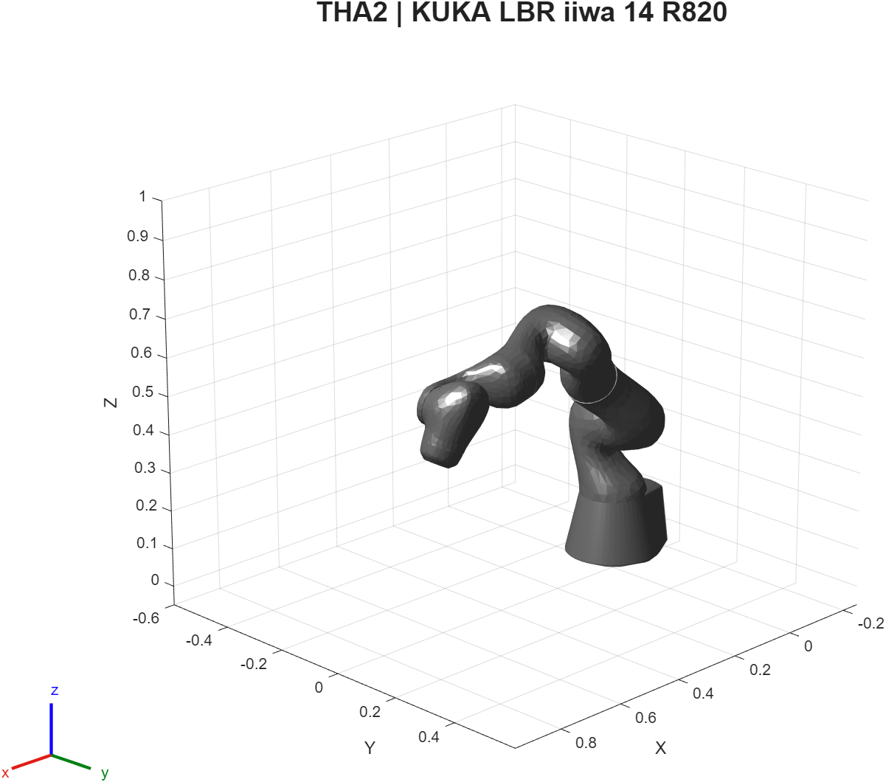
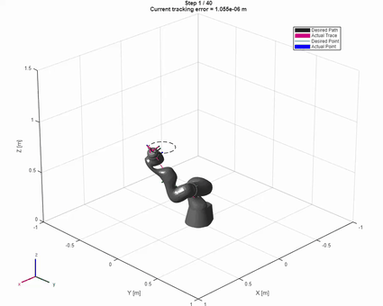
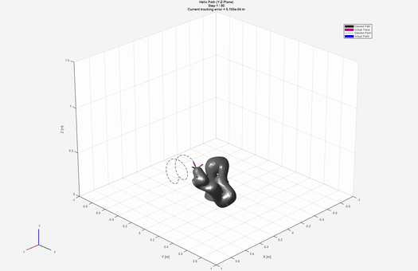
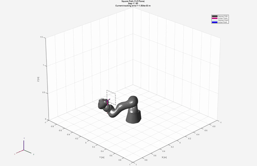
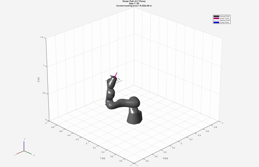
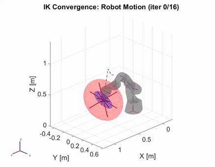
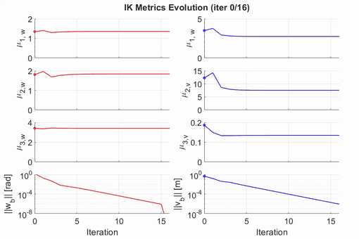
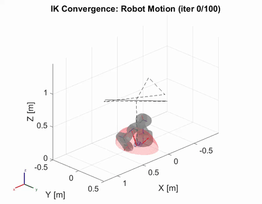
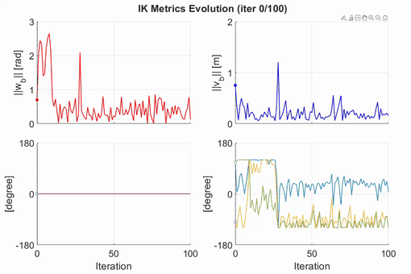
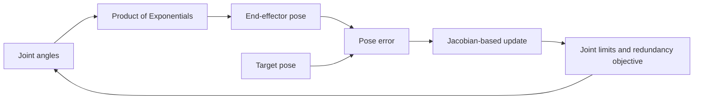

# THA2 · Kinematics of a redundant manipulator

Model a seven-degree-of-freedom **KUKA LBR iiwa 14 R820** using screw axes and the Product of Exponentials formulation, then compare inverse-kinematics strategies and redundancy objectives.



*Model visualization regenerated from the bundled URDF using MATLAB R2025b. This illustrates a configuration, not a trajectory-tracking result.*

## Video gallery

All eight original THA2 recordings are included below. Select a preview or its **Watch MP4** link to open the full recording. The looping previews use sampled frames and different playback timing; the MP4 files preserve the original recordings. These experiments show the recorded solver behavior, including tracking errors, rather than establishing convergence for every example.

### Path-following experiments

| Circle path | Helix path |
| --- | --- |
| [](results/videos/Circle_Path.mp4) | [](results/videos/Helix_Path.mp4) |
| [Watch MP4 · 5.3 s](results/videos/Circle_Path.mp4) | [Watch MP4 · 5.3 s](results/videos/Helix_Path.mp4) |

| Square path | Raster path |
| --- | --- |
| [](results/videos/Square_Path.mp4) | [](results/videos/Raster_Path.mp4) |
| [Watch MP4 · 5.3 s](results/videos/Square_Path.mp4) | [Watch MP4 · 5.3 s](results/videos/Raster_Path.mp4) |

### Inverse kinematics

| Robot motion | Metrics |
| --- | --- |
| [](results/videos/ik_robot_motion.mp4) | [](results/videos/ik_metrics.mp4) |
| [Watch MP4 · 3.4 s](results/videos/ik_robot_motion.mp4) | [Watch MP4 · 3.4 s](results/videos/ik_metrics.mp4) |

### Redundancy resolution

| Robot snapshot | Metrics |
| --- | --- |
| [](results/videos/redun_robot_motion.mp4) | [](results/videos/redun_metrics.mp4) |
| [Watch MP4 · 0.5 s](results/videos/redun_robot_motion.mp4) | [Watch MP4 · 0.9 s](results/videos/redun_metrics.mp4) |

The supplied `redun_robot_motion.mp4` contains just one frame. It is retained as an original snapshot, not presented as a complete motion sequence.

To rebuild the previews from the included recordings, run from the repository root:

```sh
python -m pip install -r tools/requirements-media.txt
python tools/build_video_previews.py
```



## Algorithms and source map

| Topic | MATLAB source in `matlab_converted/` |
| --- | --- |
| Forward kinematics | `space_product_of_exponentials.m`, `body_product_of_exponentials.m` |
| Differential kinematics | `space_jacobian.m`, `body_jacobian.m` |
| Numerical pose/position IK | `numerical_inverse_kinematics_pose.m`, `numerical_inverse_kinematics_position.m` |
| Jacobian transpose | `ik_jacobian_transpose_pose.m`, `ik_jacobian_transpose_position.m` |
| Regularization | `damped_least_square_inverse.m` |
| Redundancy objectives | `manipulability_objective.m`, `joint_limit_objective.m` |
| Diagnostics | `manipulability.m`, `manipulability_ellipsoid.m`, `check_singularity.m` |

The supplied programming report discusses pseudoinverse, damped least-squares and Jacobian-transpose approaches, alongside null-space objectives for manipulability and joint-limit avoidance. Its companion homework report derives kinematics and Jacobians for additional mechanisms. MATLAB is the documented execution path; the local Python files are earlier parallel work and excluded from the publication set.

## Run

Requires MATLAB and Robotics System Toolbox. From the repository root:

```matlab
run_asbr('tha2-ik')
run_asbr('tha2-transpose')
run_asbr('tha2-redundancy')
```

| Launcher option | Experiment script |
| --- | --- |
| `tha2-ik` | [`demo_pose_ik.m`](matlab_converted/demo_pose_ik.m) |
| `tha2-transpose` | [`demo_jacobian_transpose.m`](matlab_converted/demo_jacobian_transpose.m) |
| `tha2-redundancy` | [`demo_redundancy_resolution.m`](matlab_converted/demo_redundancy_resolution.m) |

Generated files are written under `outputs/<demo>/`. Video export is off by default; set `export_videos = true` in the selected demo to enable it. Export can take longer than the solver. The bundled `kuka_lbr_iiwa_support` directory supplies the URDF and meshes; keep its internal layout intact.

## Modify and reuse

Start with `demo_pose_ik.m`: `theta_a` sets the starting joint angles; `R_sd` and `p_sd` set the desired pose; `max_iters`, `tol_w` and `tol_v` set stopping criteria. Solvers return joint histories and error histories for comparison. Translational robot dimensions are in metres; joint angles are radians.

For direct function reuse, add only `THA2/matlab_converted` to your path. Do not combine it with THA4's identically named helpers without checking the conventions. A final iterate does not by itself establish convergence: inspect both rotation and translation errors and joint limits. The historical videos are not a guarantee that every target or parameter setting converges.

[Back to the collection](../README.md)
