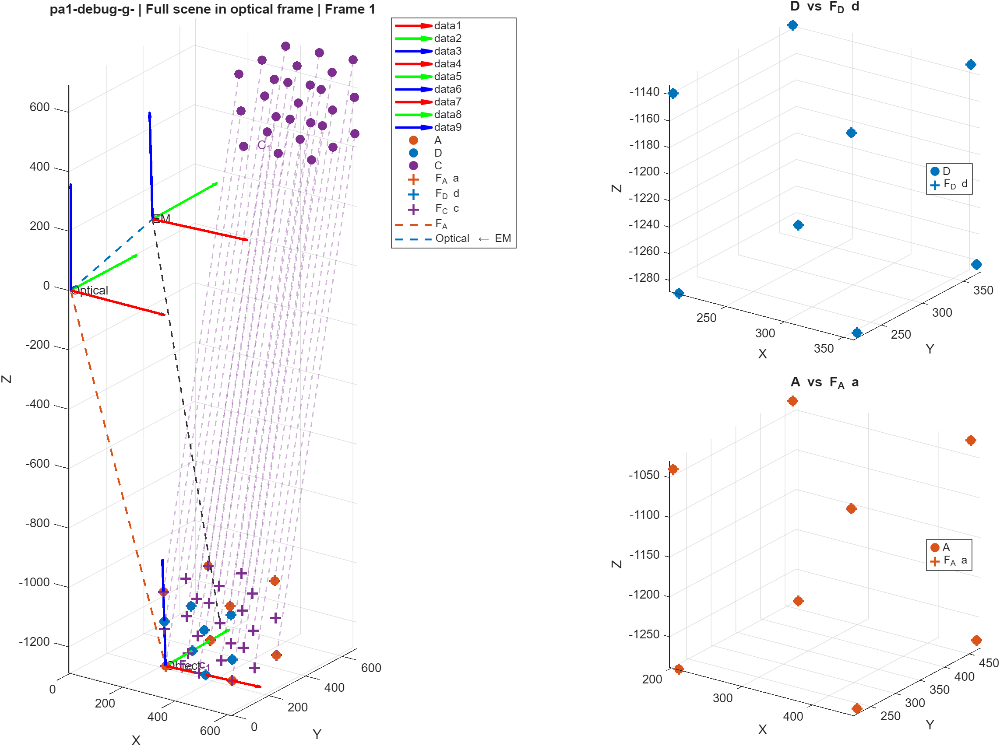

# THA3 · Registration and sensor calibration

Estimate the transformations connecting measured markers, tracked tools and an end-effector camera. The project combines point registration and pivot calibration with a quaternion solution to **AX = XB**.



*Original project output: registration frame 1 from debug dataset g. This selected figure is preserved from the supplied workspace; it is not a new accuracy benchmark.*

## Part 1: point registration and pivot calibration

The [`HW3-PA1/code`](HW3-PA1/code) directory implements rigid registration with a maximum-likelihood/SVD solution, nearest-neighbour correspondence refinement, and electromagnetic and optical pivot calibration. The pipeline estimates the transforms used to predict marker coordinates, then solves for a fixed pivot and tool-tip offset over multiple poses.

| Source | Responsibility |
| --- | --- |
| `maximum_likelihood.m`, `iterative_closest_point.m` | Rigid alignment and correspondence refinement |
| `pivot_calibration.m` | Least-squares tool-tip and fixed-pivot estimation |
| `loadDebugData.m`, `loadTestData.m` | Read the supplied text datasets |
| `demo_registration_debug.m` | Compare marker and pivot estimates against reference outputs |
| `demo_registration_unknown.m` | Process unknown datasets and save outputs |

The debug script reports mean absolute, RMS and maximum coordinate errors, plus pivot-position errors. Inputs and reference answers are under [`HW3-PA1/data`](HW3-PA1/data). Coordinates retain the dataset's units; the loader does not convert them.

## Part 2: eye-in-hand calibration

The [`HW3-PA2`](HW3-PA2) directory solves for the camera-to-end-effector transform from relative robot and camera motions. `eyeInHandQuaternion.m` estimates rotation using quaternions and SVD, then solves translation by least squares. The original report compares noise-free and noisy measurements and discusses the effect of reduced pose diversity.


## Run

From the repository root in MATLAB:

```matlab
run_asbr('tha3-registration')
run_asbr('tha3-unknown')
run_asbr('tha3-hand-eye')
```

Outputs go to `outputs/<demo>/`. The registration demo initially selects debug dataset 3; change `loadDebugData(3)` in `demo_registration_debug.m` to explore other debug sets. `tha3-hand-eye` runs [`demo_hand_eye.m`](HW3-PA2/demo_hand_eye.m), loading `data_quaternion.m` and `data_quaternion_noisy.m` and comparing object-pose consistency.

## Modify and reuse

For a new hand–eye experiment, supply paired robot/camera pose tables in the same convention as the included data. The demo reorders raw quaternion columns from scalar-last to scalar-first before passing them to the solvers. Keep the frame direction and translation units consistent.

For registration, add only the relevant `code` directory to MATLAB's path. The ICP implementation initializes with a paired rigid fit, so it should not be treated as a general global-registration method for arbitrary unrelated point clouds. Calibration also depends on sufficiently varied motion; a small residual alone cannot validate every frame convention or resolve a degenerate dataset.

[Back to the collection](../README.md)
