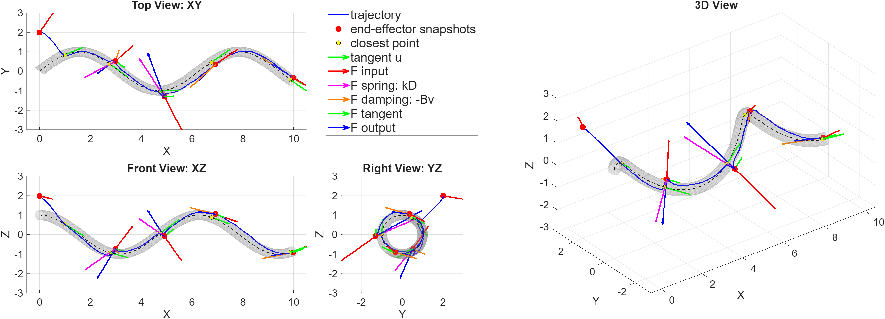
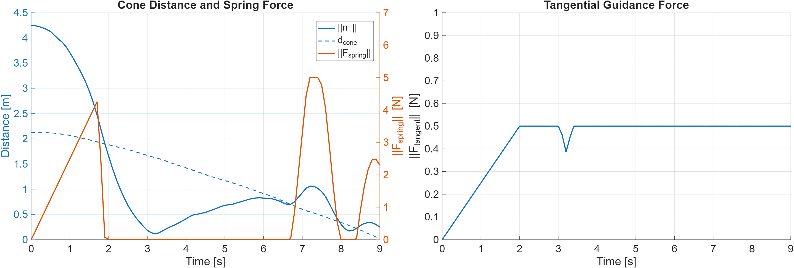
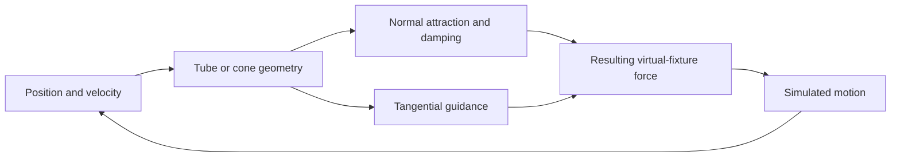

# THA4 · Virtual fixtures and constrained inverse kinematics

Guide simulated motion through tubular and conical regions using impedance forces, and solve manipulator motion as a constrained least-squares problem.



*Regenerated from the default tubular MATLAB demo. Blue shows the simulated trajectory; the shaded tube defines the reference region and arrows show force components.*



*Regenerated from the default conical MATLAB demo. These simulations illustrate force guidance; they do not validate the separate constrained IK solvers.*



*Conceptual pipeline derived from the implementation. This diagram is not a measured simulation trajectory.*

## Two approaches

| Approach | Implementation | Parameters to explore |
| --- | --- | --- |
| Tubular virtual fixture | [`hw/tubularImpedance.m`](hw/tubularImpedance.m) | Curve, tube radius, stiffness, damping and force ramp |
| Conical virtual fixture | [`hw/conicalImpedance.m`](hw/conicalImpedance.m) | Start/apex points, cone half-angle and force gains |
| Position-constrained IK | [`pa/codes/constrained_linear_ls_pos.m`](pa/codes/constrained_linear_ls_pos.m) | Goal position, tolerance, joint limits and virtual wall |
| Position/orientation IK | [`pa/codes/constrained_linear_ls_pos_and_ori.m`](pa/codes/constrained_linear_ls_pos_and_ori.m) | Goal pose and orientation objective with the same constraints |

The supplied report, *Impedance-Based Virtual Fixtures and Constrained Inverse Kinematics*, studies both compliant geometric guidance and optimization-based motion for a KUKA arm with a cylindrical tool. It includes distance/iteration sweeps and feasible/infeasible wall scenarios.

## Run

From the repository root in MATLAB:

```matlab
run_asbr('tha4-tubular')
run_asbr('tha4-conical')
```

These call `hw/demo_tubular_impedance.m` and `hw/demo_conical_impedance.m`. They use MATLAB plotting and the provided force functions. Adjust the parameters near the top of each script to change the geometry, initial state, time step and guidance gains.

For constrained IK, install **Robotics System Toolbox and Optimization Toolbox**:

```matlab
run_asbr('tha4-position')
run_asbr('tha4-pose')
run_asbr('tha4-position-sweep')
run_asbr('tha4-pose-sweep')
```

These map to `pa/codes/demo_position_ik.m`, `demo_pose_ik.m` and their `distance_iteration_sweep` variants. The launcher checks for `lsqlin` before starting. Generated output belongs in `outputs/<demo>/`; plots and videos depend on the export calls enabled in each script.

## What the results mean

The report describes convergence toward feasible points and recovery from some initial states inside the prohibited region. It also records **temporary wall penetration for distant starting configurations**: satisfying a linearized constraint does not ensure the true nonlinear motion remains outside the wall. The code should therefore be presented as an educational simulation of local constraint handling, with no claim of global collision avoidance.

The curve helper uses a local tangent update to estimate the nearest curve point. Its success depends on the initial curve parameter and geometry. Force routines estimate velocity from successive samples and require distinct sample times. Keep units consistent and check time-step sensitivity when changing stiffness or damping.

The older `PART 1` implementation remains local and is excluded from the public source set; `hw` is the documented virtual-fixture implementation. Optimization Toolbox was not available during local preparation, so the constrained solvers require further runtime validation.

[Back to the collection](../README.md)
